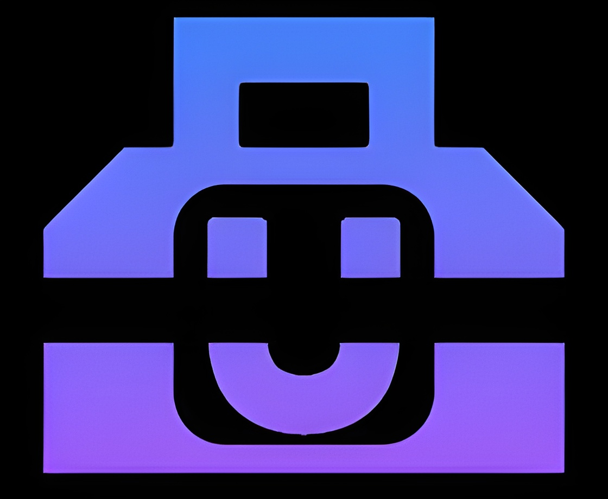

    
    <h1>Ult Kit - The Ultimate Creation Toolkit</h1>
    
     
     
    

        
        
        
    

    

        
        
        
        
        
        
    

> [!IMPORTANT]
> This is a public beta preview of Ult Kit. Code for site is privated.

 
 
 
 
 
 
<h2 align="center">My Socials</h2>

    
&nbsp;

